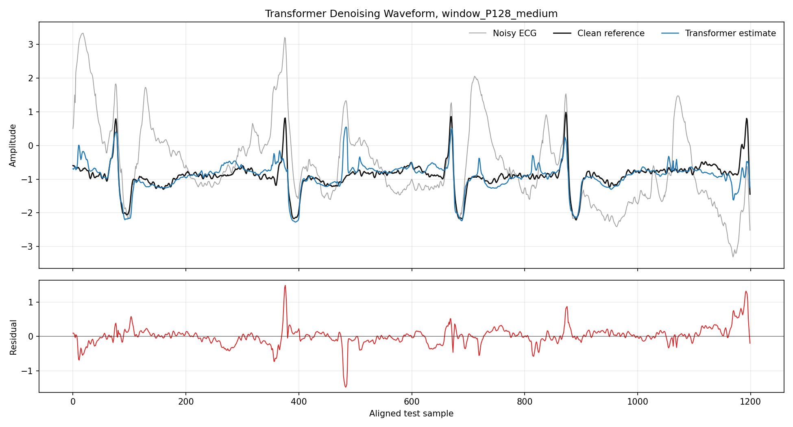
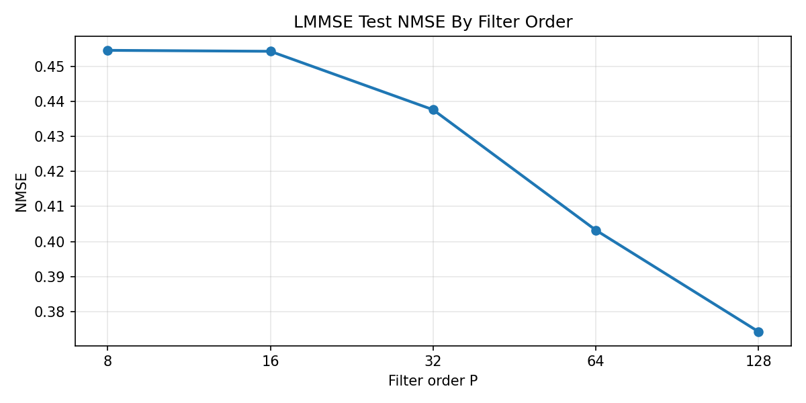
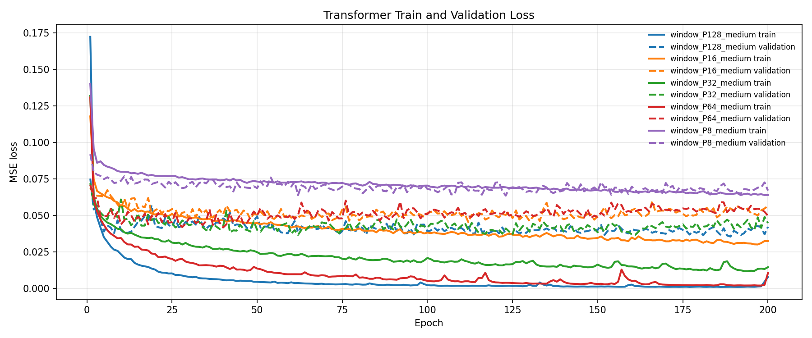
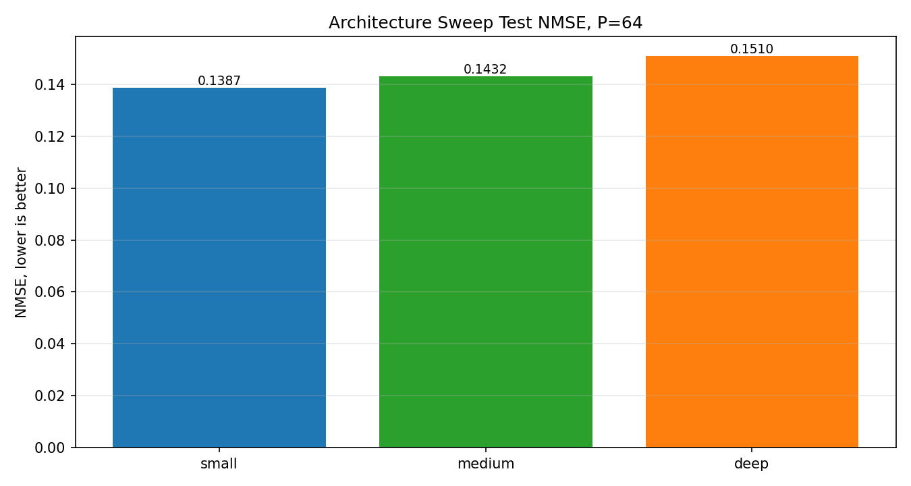
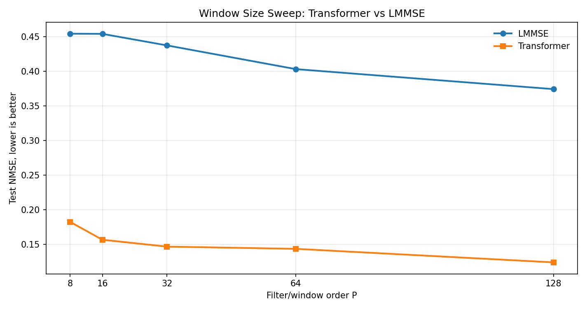
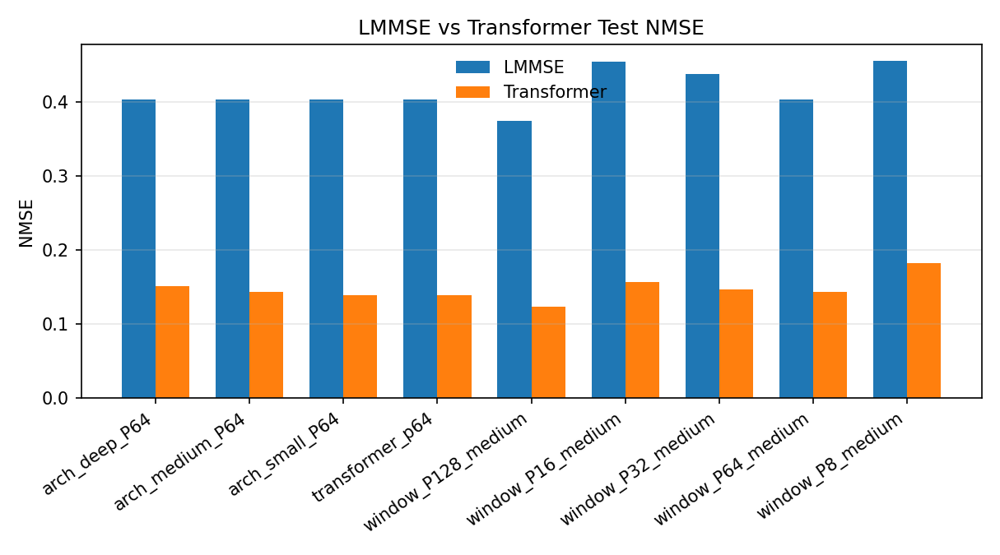
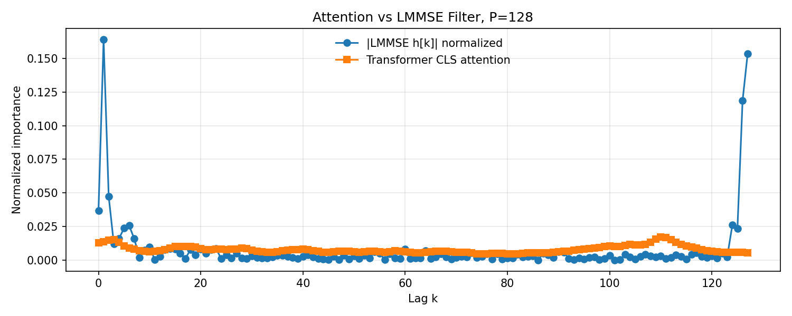

# ECG Denoising LMMSE

Author: Varun Moparthi

## Abstract

ECG Denoising LMMSE implements a complete ECG noise removal study on paired PhysioNet signals, using clean ECG from MIT BIH record `118` and noisy ECG from NSTDB record `118e06`. The project constructs aligned train and test arrays, characterizes the signal and noise with autocorrelation and Welch spectral estimates, derives a sample wise LMMSE estimator from lagged noisy ECG windows, and compares that linear estimator against Transformer encoder denoisers trained on the same causal window formulation.

The denoising task is treated as clean sample reconstruction from a local noisy context, where each model receives `y_P[n] = [y[n], y[n-1], ..., y[n-P+1]]^T` and predicts `s[n]`. The LMMSE branch solves the empirical normal equation `R_yy h = r_sy` for multiple filter orders, while the Transformer branch learns a nonlinear CLS token representation over the same window sizes. The final analysis includes order sweeps, architecture sweeps, train and validation loss curves, test NMSE tables, denoised waveform views, and attention and filter comparisons.

On the completed test split, the best LMMSE filter reaches NMSE `0.37433756` at `P=128`, while the best Transformer run reaches NMSE `0.12366345` with `window_P128_medium`. The result shows that learned nonlinear temporal context modeling provides a much stronger denoising fit than the linear LMMSE estimator for this ECG and noise pairing, while still keeping the experiment interpretable through matched window orders and filter and attention diagnostics.

## Output Gallery

The best qualitative denoising example comes from `window_P128_medium`, the strongest Transformer run in the completed sweep. The grey trace shows the noisy ECG, the black trace is the clean reference, and the blue trace is the Transformer estimate. The residual panel below the waveform shows the remaining error after denoising, making the signal recovery easier to inspect than a metric table alone.



Additional tracked visual outputs:

| Figure | Path |
| --- | --- |
| Clean and noisy ECG preview | `outputs/visualiser/lmmse/signal_preview.png` |
| Autocorrelation | `outputs/visualiser/lmmse/autocorrelation.png` |
| Welch PSD | `outputs/visualiser/lmmse/welch_psd.png` |
| LMMSE filters | `outputs/visualiser/lmmse/lmmse_filters.png` |
| Transformer train and validation losses | `outputs/visualiser/transformer/window_train_validation_losses.png` |
| Transformer architecture comparison | `outputs/visualiser/transformer/architecture_nmse_comparison.png` |
| LMMSE and Transformer NMSE comparison | `outputs/visualiser/transformer/window_nmse_vs_lmmse.png` |
| Attention and LMMSE filter comparison | `outputs/evaluation/attention_vs_lmmse_P128.png` |

## Data Source

The data pipeline creates four one dimensional NumPy arrays:

| File | Meaning | Samples |
| --- | --- | ---: |
| `data/s_train.npy` | clean training ECG | 21000 |
| `data/y_train.npy` | noisy training ECG | 21000 |
| `data/s_test.npy` | clean test ECG | 9000 |
| `data/y_test.npy` | noisy test ECG | 9000 |

The clean ECG comes from PhysioNet MIT BIH Arrhythmia Database record `118`. The noisy ECG comes from MIT BIH Noise Stress Test Database record `118e06`. The split begins at sample `108000`, corresponding to `300` seconds at `360 Hz`, so the selected segment lies in the noisy portion of the NSTDB record. The project stores metadata in `data/dataset_metadata.json`, but the data arrays and downloaded WFDB records are ignored by Git so the repository stays light.

## Method

### Observation Model And Windowing

The noisy ECG is modeled as an additive corruption of the clean cardiac trace:

$$
y[n] = s[n] + w[n],
$$

where $s[n]$ is the clean ECG sample, $w[n]$ is the noise process, and $y[n]$ is the measured noisy ECG. Both denoisers are trained and evaluated on a causal lag window of length $P$:

$$
\mathbf{y}_P[n] =
\begin{bmatrix}
y[n] & y[n-1] & \cdots & y[n-P+1]
\end{bmatrix}^{\mathsf T}.
$$

The aligned supervised target is the newest clean sample $s[n]$. For a signal segment of length $N$, the number of usable supervised examples is

$$
M = N - P + 1.
$$

The design matrix used by both branches is

$$
\mathbf{Y}_P =
\begin{bmatrix}
\mathbf{y}_P[P-1]^{\mathsf T} \\
\mathbf{y}_P[P]^{\mathsf T} \\
\vdots \\
\mathbf{y}_P[N-1]^{\mathsf T}
\end{bmatrix}
\in \mathbb{R}^{M \times P},
$$

with target vector

$$
\mathbf{s}_P =
\begin{bmatrix}
s[P-1] & s[P] & \cdots & s[N-1]
\end{bmatrix}^{\mathsf T}.
$$

The implementation uses this exact lagged construction in `utils/data_io.py`. The window is reversed so the first coordinate is the most recent noisy sample $y[n]$, matching the causal filter notation above.

### Signal And Noise Statistics

Before denoising, the project estimates the clean ECG autocorrelation and the training noise autocorrelation. The noise is computed directly from the paired arrays:

$$
w_{\text{train}}[n] = y_{\text{train}}[n] - s_{\text{train}}[n].
$$

For a one dimensional sequence $x[n]$, the biased autocorrelation estimate is

$$
\hat r_x[k] =
\frac{1}{N}
\sum_{n=0}^{N-|k|-1}
x[n+|k|]x[n],
\qquad
k = -(L-1), \ldots, L-1.
$$

The experiment uses $L = 256$. If the noise were close to white, $\hat r_w[k]$ would concentrate strongly at $k=0$ and be small away from zero. The generated evaluation reports a noise autocorrelation whiteness ratio of `0.998270`, so the selected noise segment is not well described by an ideal white noise model.

The spectral analysis uses Welch PSD estimation with Hann windows of length $512$ and overlap $256$. For segment $m$, window $a[t]$, and DFT length $K$, the periodogram is

$$
\hat S_{x,m}[q] =
\frac{1}{F_s U}
\left|
\sum_{t=0}^{K-1} a[t]x_m[t]e^{-j2\pi qt/K}
\right|^2,
$$

where $F_s = 360$ Hz and $U = \sum_t a[t]^2$. Welch's estimate averages segment periodograms:

$$
\hat S_x[q] = \frac{1}{B}\sum_{m=1}^{B}\hat S_{x,m}[q].
$$

The resulting clean ECG PSD peaks near `6.328 Hz`, while the noise PSD peaks near `0.703 Hz`.

### LMMSE Derivation

The LMMSE branch restricts the denoiser to a linear function of the noisy window:

$$
\hat s[n] = \mathbf{h}^{\mathsf T}\mathbf{y}_P[n],
$$

where $\mathbf{h}\in\mathbb{R}^P$ is the filter coefficient vector. The population objective is

$$
J(\mathbf{h}) =
\mathbb{E}
\left[
\left(
s[n] - \mathbf{h}^{\mathsf T}\mathbf{y}_P[n]
\right)^2
\right].
$$

Expanding the quadratic gives

$$
J(\mathbf{h}) =
\mathbb{E}[s[n]^2]
- 2\mathbf{h}^{\mathsf T}\mathbf{r}_{sy}
+ \mathbf{h}^{\mathsf T}\mathbf{R}_{yy}\mathbf{h},
$$

with

$$
\mathbf{R}_{yy} =
\mathbb{E}
\left[
\mathbf{y}_P[n]\mathbf{y}_P[n]^{\mathsf T}
\right],
\qquad
\mathbf{r}_{sy} =
\mathbb{E}
\left[
\mathbf{y}_P[n]s[n]
\right].
$$

Taking the gradient and setting it to zero gives the normal equation:

$$
\nabla_{\mathbf{h}}J(\mathbf{h})
= -2\mathbf{r}_{sy} + 2\mathbf{R}_{yy}\mathbf{h}
= \mathbf{0},
$$

so

$$
\mathbf{R}_{yy}\mathbf{h}^{\star} = \mathbf{r}_{sy},
\qquad
\mathbf{h}^{\star} = \mathbf{R}_{yy}^{-1}\mathbf{r}_{sy}.
$$

The implementation uses empirical training estimates:

$$
\hat{\mathbf{R}}_{yy} =
\frac{1}{M}\mathbf{Y}_P^{\mathsf T}\mathbf{Y}_P,
\qquad
\hat{\mathbf{r}}_{sy} =
\frac{1}{M}\mathbf{Y}_P^{\mathsf T}\mathbf{s}_P.
$$

A small ridge term stabilizes the solve:

$$
\hat{\mathbf{h}} =
\left(
\hat{\mathbf{R}}_{yy} + \lambda\mathbf{I}
\right)^{-1}
\hat{\mathbf{r}}_{sy},
\qquad
\lambda = 10^{-8}.
$$

Inference applies the learned filter to test windows:

$$
\hat{\mathbf{s}}_{\text{test}} =
\mathbf{Y}_{P,\text{test}}\hat{\mathbf{h}}.
$$

The project estimates separate filters for $P\in\{8,16,32,64,128\}$, stores each filter in `outputs/lmmse/lmmse_order_<P>.npz`, and stores the full sweep in `outputs/lmmse/lmmse_results.json`.

### Transformer Denoiser

The Transformer branch keeps the same supervised window target but replaces the linear filter with a learned nonlinear sequence model:

$$
\hat s[n] = f_{\theta}(\mathbf{y}_P[n]).
$$

First, every scalar in the window is normalized using the noisy training statistics:

$$
\tilde x = \frac{x - \mu_y}{\sigma_y},
\qquad
\mu_y = \mathrm{mean}(y_{\text{train}}),
\qquad
\sigma_y = \mathrm{std}(y_{\text{train}}).
$$

For a normalized window $\tilde{\mathbf{y}}_P[n]$, each scalar is projected into a $d_{\text{model}}$ dimensional token:

$$
\mathbf{e}_i = \mathbf{W}_{in}\tilde y_i + \mathbf{b}_{in},
\qquad
i = 1,\ldots,P.
$$

A learned CLS token $\mathbf{c}$ is prepended, producing a sequence of length $P+1$:

$$
\mathbf{Z}^{(0)} =
\begin{bmatrix}
\mathbf{c} \\
\mathbf{e}_1 \\
\vdots \\
\mathbf{e}_P
\end{bmatrix}
+ \mathrm{PE}.
$$

The positional encoding is sinusoidal:

$$
\mathrm{PE}_{pos,2i} =
\sin\left(\frac{pos}{10000^{2i/d_{\text{model}}}}\right),
\qquad
\mathrm{PE}_{pos,2i+1} =
\cos\left(\frac{pos}{10000^{2i/d_{\text{model}}}}\right).
$$

Each encoder block uses multi-head self-attention followed by a GELU feedforward network. For one attention head,

$$
\mathbf{Q} = \mathbf{Z}\mathbf{W}_Q,
\qquad
\mathbf{K} = \mathbf{Z}\mathbf{W}_K,
\qquad
\mathbf{V} = \mathbf{Z}\mathbf{W}_V,
$$

and

$$
\mathrm{Attn}(\mathbf{Z}) =
\mathrm{softmax}
\left(
\frac{\mathbf{Q}\mathbf{K}^{\mathsf T}}{\sqrt{d_k}}
\right)
\mathbf{V}.
$$

Multi-head attention concatenates the head outputs and projects them back to the model dimension:

$$
\mathrm{MHA}(\mathbf{Z}) =
\mathrm{Concat}
\left(
\mathrm{head}_1,\ldots,\mathrm{head}_H
\right)\mathbf{W}_O.
$$

The implemented block uses residual connections and layer normalization:

$$
\mathbf{U}^{(\ell)} =
\mathrm{LayerNorm}
\left(
\mathbf{Z}^{(\ell-1)} +
\mathrm{Dropout}
\left(
\mathrm{MHA}(\mathbf{Z}^{(\ell-1)})
\right)
\right),
$$

then

$$
\mathbf{Z}^{(\ell)} =
\mathrm{LayerNorm}
\left(
\mathbf{U}^{(\ell)} +
\mathrm{Dropout}
\left(
\mathbf{W}_2
\mathrm{GELU}
\left(
\mathbf{W}_1\mathbf{U}^{(\ell)}+\mathbf{b}_1
\right)
+ \mathbf{b}_2
\right)
\right).
$$

After $L$ encoder layers, the CLS state is mapped to one clean sample estimate:

$$
\hat{\tilde s}[n] =
\mathbf{w}_{out}^{\mathsf T}
\mathrm{LayerNorm}
\left(
\mathbf{Z}^{(L)}_{\text{CLS}}
\right)
+ b_{out}.
$$

The estimate is then denormalized:

$$
\hat s[n] =
\sigma_y\hat{\tilde s}[n] + \mu_y.
$$

### Training Objective And Sweeps

The model is trained with mean squared error on normalized clean ECG targets:

$$
\mathcal{L}(\theta) =
\frac{1}{M_{\text{train}}}
\sum_{n}
\left(
\tilde s[n] -
f_{\theta}(\tilde{\mathbf{y}}_P[n])
\right)^2.
$$

The train split uses the first `85%` of generated training windows and the validation split uses the final `15%`. Every Transformer run trains for `200` epochs with Adam, learning rate `1e-3`, batch size `256`, dropout `0.1`, and gradient clipping at norm `1.0`.

The architecture sweep fixes $P=64$ and compares:

| Name | `d_model` | heads | layers | feedforward |
| --- | ---: | ---: | ---: | ---: |
| `small` | 32 | 4 | 2 | 128 |
| `medium` | 64 | 4 | 3 | 256 |
| `deep` | 64 | 8 | 4 | 256 |

The window sweep fixes the `medium` architecture and evaluates $P\in\{8,16,32,64,128\}$.

### Inference And Evaluation

LMMSE inference applies $\hat{\mathbf{h}}$ to every test window. Transformer inference runs the test windows through the trained model, denormalizes predictions, and aligns them to the same target convention $s[P-1],\ldots,s[N-1]$.

The primary metric is normalized mean squared error:

$$
\mathrm{NMSE} =
\frac{
\sum_n
\left(
s[n] - \hat s[n]
\right)^2
}{
\sum_n s[n]^2
}.
$$

The code also stores mean squared error:

$$
\mathrm{MSE} =
\frac{1}{N}
\sum_n
\left(
s[n] - \hat s[n]
\right)^2.
$$

For interpretability, inference saves the average CLS attention distribution. For each $P$, the analysis normalizes both the attention vector and the absolute LMMSE coefficients:

$$
\alpha_k =
\frac{\bar a_k}{\sum_j \bar a_j},
\qquad
\beta_k =
\frac{|\hat h_k|}{\sum_j |\hat h_j|}.
$$

The plotted attention and filter comparison shows whether the Transformer focuses on temporal positions similar to those emphasized by the linear LMMSE filter.

## Results

### LMMSE Sweep

| P | Test NMSE | Aligned samples | Filter norm |
| ---: | ---: | ---: | ---: |
| 8 | 0.45455394 | 8993 | 0.378638 |
| 16 | 0.45427845 | 8985 | 0.440204 |
| 32 | 0.43762223 | 8969 | 0.699592 |
| 64 | 0.40329022 | 8937 | 0.697101 |
| 128 | 0.37433756 | 8873 | 0.555837 |

The LMMSE trend improves as the filter order increases. The best LMMSE result is `P=128`, but the method remains limited because the ECG/noise relationship is not fully captured by a linear stationary filter.



### Transformer Sweep

| Run | P | Final train loss | Final validation loss | Test NMSE | Test MSE |
| --- | ---: | ---: | ---: | ---: | ---: |
| `arch_small_P64` | 64 | 0.01151857 | 0.05396836 | 0.13872611 | 0.14016187 |
| `arch_medium_P64` | 64 | 0.01061656 | 0.04986817 | 0.14324441 | 0.14472693 |
| `arch_deep_P64` | 64 | 0.01074144 | 0.05094075 | 0.15095983 | 0.15252221 |
| `window_P8_medium` | 8 | 0.06404387 | 0.06708255 | 0.18213470 | 0.18368720 |
| `window_P16_medium` | 16 | 0.03254132 | 0.05668371 | 0.15638778 | 0.15775682 |
| `window_P32_medium` | 32 | 0.01465691 | 0.04484816 | 0.14647637 | 0.14783353 |
| `window_P64_medium` | 64 | 0.01061656 | 0.04986817 | 0.14324441 | 0.14472693 |
| `window_P128_medium` | 128 | 0.00788836 | 0.04227321 | 0.12366345 | 0.12527506 |

The best architecture sweep run is `arch_small_P64`. In the window sweep, increasing context improves test NMSE, with `window_P128_medium` giving the strongest result. The validation curves show that the models learn quickly and that the final validation loss is tracked for every run, not only the final test score.





### LMMSE vs Transformer

| Transformer run | P | LMMSE NMSE | Transformer NMSE | Difference |
| --- | ---: | ---: | ---: | ---: |
| `arch_small_P64` | 64 | 0.40329022 | 0.13872611 | -0.26456411 |
| `arch_medium_P64` | 64 | 0.40329022 | 0.14324441 | -0.26004581 |
| `arch_deep_P64` | 64 | 0.40329022 | 0.15095983 | -0.25233039 |
| `window_P8_medium` | 8 | 0.45455394 | 0.18213470 | -0.27241924 |
| `window_P16_medium` | 16 | 0.45427845 | 0.15638778 | -0.29789066 |
| `window_P32_medium` | 32 | 0.43762223 | 0.14647637 | -0.29114585 |
| `window_P64_medium` | 64 | 0.40329022 | 0.14324441 | -0.26004581 |
| `window_P128_medium` | 128 | 0.37433756 | 0.12366345 | -0.25067412 |

Across every comparable order, the Transformer has a lower NMSE than the LMMSE filter. The gap is especially clear in the window sweep, where the Transformer curve remains far below the LMMSE curve for all tested `P`.





### Attention vs LMMSE Filter

For interpretability, the pipeline extracts the mean CLS attention distribution from Transformer inference and compares it to the normalized absolute LMMSE filter coefficients. This does not require the Transformer attention to match the linear filter exactly; instead, it gives a diagnostic view of whether the learned model emphasizes similar temporal positions.

| Run | P | Attention and filter correlation |
| --- | ---: | ---: |
| `window_P8_medium` | 8 | -0.373772 |
| `window_P16_medium` | 16 | 0.203514 |
| `window_P32_medium` | 32 | 0.031165 |
| `window_P64_medium` | 64 | 0.232308 |
| `window_P128_medium` | 128 | 0.124198 |



## Repository Layout

```text
configs/             YAML configuration for data, LMMSE, Transformer, sweeps, visualizers, and evaluation
data/                Local PhysioNet arrays and metadata; ignored except data/.gitkeep
evaluation/          Metric summaries, method comparison, and attention and filter analysis
execution_scripts/   Shell entry points for reproducible pipeline runs
logs/                Tracked run logs from data creation, LMMSE, Transformer training, and evaluation
models/              ECG Transformer denoiser definition
modules/             Transformer encoder blocks and positional encoding
outputs/             Tracked generated metrics, curves, NumPy artifacts, markdown summaries, and figures
scripts/             Data creation, LMMSE execution, Transformer training, sweep, and inference scripts
utils/               Config loading, PhysioNet utilities, metrics, logging, and signal processing helpers
visualiser/          Plot builders for LMMSE, Transformer, and final figures
```

## License

This project is released under the MIT License.

Copyright (c) 2026 Varun Moparthi
